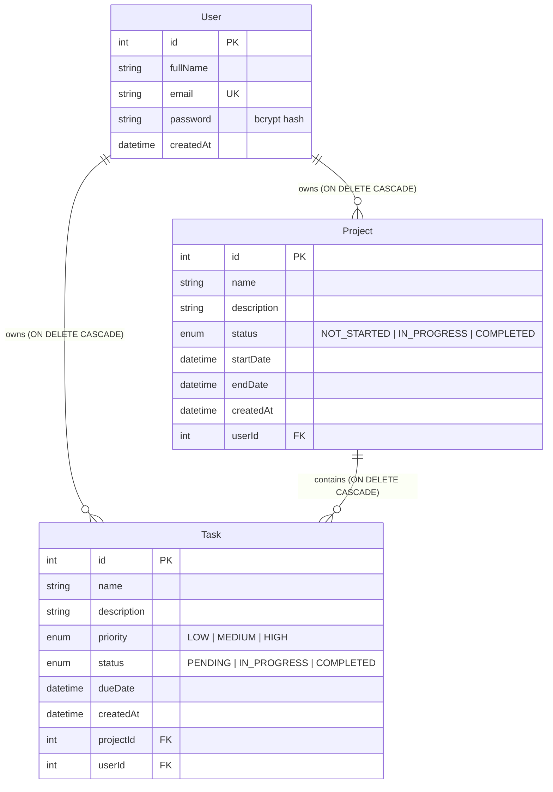

# Entity-Relationship Diagram

```mermaid
erDiagram
    User ||--o{ Project : "owns (ON DELETE CASCADE)"
    User ||--o{ Task : "owns (ON DELETE CASCADE)"
    Project ||--o{ Task : "contains (ON DELETE CASCADE)"

    User {
        int id PK
        string fullName
        string email UK
        string password "bcrypt hash"
        datetime createdAt
    }
    Project {
        int id PK
        string name
        string description
        enum status "NOT_STARTED | IN_PROGRESS | COMPLETED"
        datetime startDate
        datetime endDate
        datetime createdAt
        int userId FK
    }
    Task {
        int id PK
        string name
        string description
        enum priority "LOW | MEDIUM | HIGH"
        enum status "PENDING | IN_PROGRESS | COMPLETED"
        datetime dueDate
        datetime createdAt
        int projectId FK
        int userId FK
    }
```

Source of truth: `backend/prisma/schema.prisma` and `backend/prisma/migrations/`.
